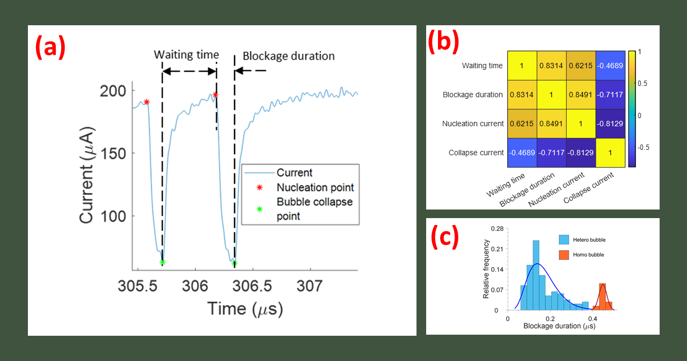

# NanobubbleDigitizer

NanobubbleDigitizer is a MATLAB based nanopore data analysis interface, which can be used to analysis the current-time data of bubble generation in solid-state nanopore.	

## Installation 

Download the repository files as a .zip and extract in a folder in your PC. MATLAB (Mathworks.Inc) should be pre-installed to run the code.

## NanobubbleDigitizer user manual

Fig.1 (a) Current time trace of nanopore bubble blockage. By running the algorithm, we have automated the detection of the nucleation point and collapse point. From these two points, 4 features are extracted. The current values at the nucleation point and collapse point gives nucleation current and collapse current respectively. The time separation between the nucleation point of a bubble and the collapse point of the previous bubble gives the waiting time for bubble nucleation. The time separation between the nucleation point and collapse point of the same bubble gives the blockage duration. (b) The heat map shows the correlation coefficient between the 4 features. (c) The histogram shows two peaks related to blockage duration, indicating two types of nanopore bubbles. The second peak which happens at a higher value of blockage duration indicates homogeneous bubbles nucleating at the pore center while the first peak at lower value of blockage duration indicates heterogenous bubbles on the cylindrical pore surface.

**1**: detectingsignals.m is the primary code for bubble signal detection. A csv file containing time series data for current is the only input file needed to run this code.

**2**: The code has been divided into 6 sections. Section 0 deals with reading the input file and setting the parameters. Section 1 deals with the segmentation of the bubble signals. In Section 2, two cut points are chosen which are then refined in Section 3. Based on the refined cut points, the nucleation and collapse points are calculated in Sections 4 and 5 respectively. 

## References

**1**: Paul, S., Hsu, W.L., Magnini, M., Mason, L.R., Ho, Y.L., Matar, O.K. and Daiguji, H., 2020. Single-bubble dynamics in nanopores: Transition between homogeneous and heterogeneous nucleation. Physical Review Research, 2(4), p.043400.

**2**: Paul, S., Hsu, W.L., Magnini, M., Mason, L.R., Ito, Y., Ho, Y.L., Matar, O.K. and Daiguji, H., 2021. Analysis and control of vapor bubble growth inside solid-state nanopores. Journal of Thermal Science and Technology, 16(1), pp.JTST0007-JTST0007.

## Website Under Construction
